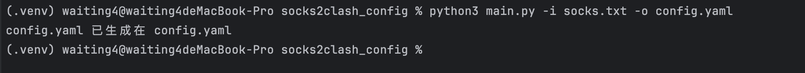
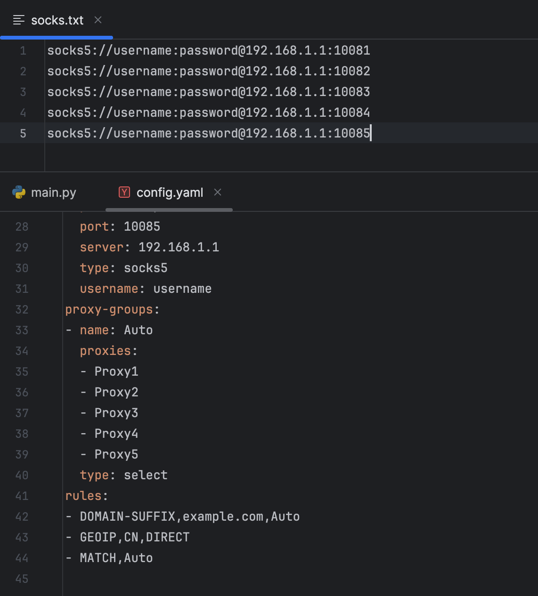

# socks2clash
## 前情提要
使用 `xray-core` 将 `trojan` 转换为 `socks` 之后，在操作系统上落地配置的时候，可以直接使用系统代理或者 `proxyswitch` 这一类工具，但是要落地在安卓或者ios的时候始终没有合适的方案。最后调研可以使用 `clash` 导成一个订阅 `URL`,随后通过 `URL` 把配置文件入安卓终端中，实现给每一个手机配置不同代理，再也不用人工去敲配置文件了，一次性可以多将几个 `socks` 封装进 `config`。这样子可以挂一个换一个，相当的舒服。

## 使用方法
```
(.venv) waiting4@waiting4deMacBook-Pro socks2clash_config % python3 main.py -i socks.txt -o config.yaml  
config.yaml 已生成在 config.yaml  

-i 指定输入  
-o 指定输出  
```


`socks` 一行一个,`config.yaml` 直接通过 `python web` 服务提供给 `clash` 终端下载即可冲浪。  
